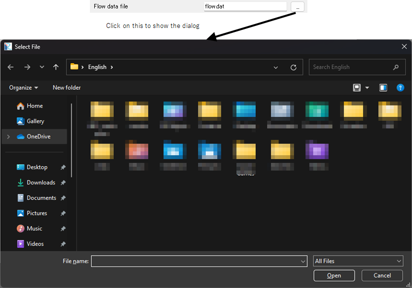

File name (for reading)
=================================

Definition
-------------

.. code-block:: xml
   :caption: Example of a file name type (for reading) condition definition
   :name: widget_example_filename_load_def
   :linenos:

   <Item name="flowdatafile" caption="Flow data file">
     <Definition valueType="filename" default="flow.dat" />
   </Item>

Example of widget
------------------------

.. _widget_example_filename_load:

   Widget example of a file name (for reading) type condition

Example code to read data
------------------------------

Calculation condition, Grid generating condition
~~~~~~~~~~~~~~~~~~~~~~~~~~~~~~~~~~~~~~~~~~~~~~~~~~~~~

FORTRAN
''''''''''

.. code-block:: fortran
   :caption: Code example to load a file name (for reading) type condition (for calculation conditions and grid generating conditions) FORTRAN
   :name: widget_example_filename_read_load_calccond_fortran
   :linenos:

   integer:: ier
   character(200):: flowdatafile

   call cg_iRIC_Read_String(fid, "flowdatafile", flowdatafile, ier)

C/C++
''''''''''

.. code-block:: c
   :caption: Code example to load a file name (for reading) type condition (for calculation conditions and grid generating conditions) C/C++
   :name: widget_example_filename_read_load_calccond_c
   :linenos:

   int ier;
   char flowdatafile[200];

   ier = cg_iRIC_Read_String(fid, "flowdatafile", flowdatafile)

Python
''''''''''

.. code-block:: python
   :caption: Code example to load a file name (for reading) type condition (for calculation conditions and grid generating conditions) Python
   :name: widget_example_filename_read_load_calccond_python
   :linenos:

   flowdatafile = cg_iRIC_Read_String(fid, "flowdatafile")

Boundary condition
~~~~~~~~~~~~~~~~~~~~~~

FORTRAN
''''''''''

.. code-block:: fortran
   :caption: Code example to load a file name (for reading) type condition (for boundary conditions) FORTRAN
   :name: widget_example_filename_read_load_bcond_fortran
   :linenos:

   integer:: ier
   character(200):: flowdatafile

   call cg_iRIC_Read_BC_String(fid, "inflow", 1, "flowdatafile", flowdatafile, ier)

C/C++
''''''''''

.. code-block:: c
   :caption: Code example to load a file name (for reading) type condition (for boundary conditions) C/C++
   :name: widget_example_filename_read_load_bcond_c
   :linenos:

   int ier;
   char flowdatafile[200];

   ier = cg_iRIC_Read_BC_String(fid, "inflow", 1, "flowdatafile", flowdatafile)

Python
''''''''''

.. code-block:: python
   :caption: Code example to load a file name (for reading) type condition (for boundary conditions) Python
   :name: widget_example_filename_read_load_bcond_python
   :linenos:

   flowdatafile = cg_iRIC_Read_BC_String(fid, "inflow", 1, "flowdatafile")
