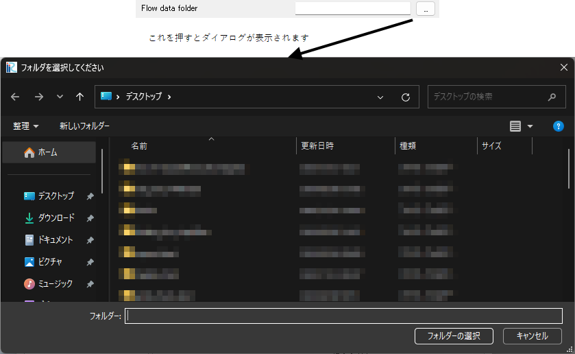

フォルダ名
-----------

.. code-block:: xml
   :caption: ファイル名 (書き込み用) の条件の定義例
   :name: widget_example_foldername_def
   :linenos:

   <Item name="flowdatafolder" caption="Flow data folder">
     <Definition valueType="foldername" />
   </Item>

.. _widget_example_folder:

   フォルダ名の条件の表示例

.. code-block:: fortran
   :caption: フォルダ名の条件を読み込むための処理の記述例 (計算条件・格子生成条件)
   :name: widget_example_foldername_load_calccond
   :linenos:

   integer:: ier
   character(200):: flowdatafolder

   call cg_iric_read_string(fid, "flowdatafolder", flowdatafolder, ier)

.. code-block:: fortran
   :caption: フォルダ名の条件を読み込むための処理の記述例 (境界条件)
   :name: widget_example_foldername_load_bcond
   :linenos:

   integer:: ier
   character(200):: flowdatafolder

   call cg_iric_read_bc_string(fid, "inflow", 1, "flowdatafolder", flowdatafolder, ier)
