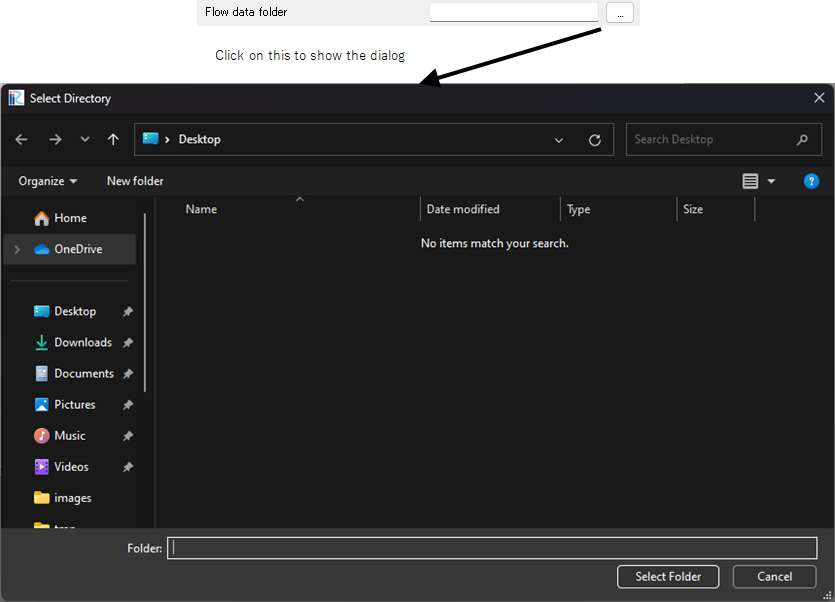

Folder name
===============

Definition
-------------

.. code-block:: xml
   :caption: Example of a folder name type condition definition
   :name: widget_example_foldername_def
   :linenos:

   <Item name="flowdatafolder" caption="Flow data folder">
     <Definition valueType="foldername" />
   </Item>

Example of widget
------------------------

.. _widget_example_folder:

   Widget example of a folder name type condition

Example code to read data
------------------------------

Calculation condition, Grid generating condition
~~~~~~~~~~~~~~~~~~~~~~~~~~~~~~~~~~~~~~~~~~~~~~~~~~~~~

FORTRAN
'''''''''''

.. code-block:: fortran
   :caption: Code example to load a folder name type condition (for calculation conditions and grid generating conditions) FORTRAN
   :name: widget_example_foldername_load_calccond_fortran
   :linenos:

   integer:: ier
   character(200):: flowdatafolder

   call cg_iRIC_Read_String(fid, "flowdatafolder", flowdatafolder, ier)

C/C++
''''''''''

.. code-block:: c
   :caption: Code example to load a folder name type condition (for calculation conditions and grid generating conditions) C/C++
   :name: widget_example_foldername_load_calccond_c
   :linenos:

   int ier
   char flowdatafolder[200];

   ier = cg_iRIC_Read_String(fid, "flowdatafolder", flowdatafolder)

Python
''''''''''

.. code-block:: python
   :caption: Code example to load a folder name type condition (for calculation conditions and grid generating conditions) Python
   :name: widget_example_foldername_load_calccond_python
   :linenos:

   flowdatafolder = cg_iRIC_Read_String(fid, "flowdatafolder")

Boundary condition
~~~~~~~~~~~~~~~~~~~~~~~~

FORTRAN
''''''''''

.. code-block:: fortran
   :caption: Code example to load a folder name type condition (for boundary conditions) FORTRAN
   :name: widget_example_foldername_load_bcond_fortran
   :linenos:

   integer:: ier
   character(200):: flowdatafolder

   call cg_iRIC_Read_BC_String(fid, "inflow", 1, "flowdatafolder", flowdatafolder, ier)

C/C++
''''''''''

.. code-block:: c
   :caption: Code example to load a folder name type condition (for boundary conditions) C/C++
   :name: widget_example_foldername_load_bcond_c
   :linenos:

   int ier
   char flowdatafolder[200];

   ier = cg_iRIC_Read_BC_String(fid, "inflow", 1, "flowdatafolder", flowdatafolder)

Python
''''''''''

.. code-block:: python
   :caption: Code example to load a folder name type condition (for boundary conditions) Python
   :name: widget_example_foldername_load_bcond_python
   :linenos:

   flowdatafolder = cg_iRIC_Read_BC_String(fid, "inflow", 1, "flowdatafolder")
