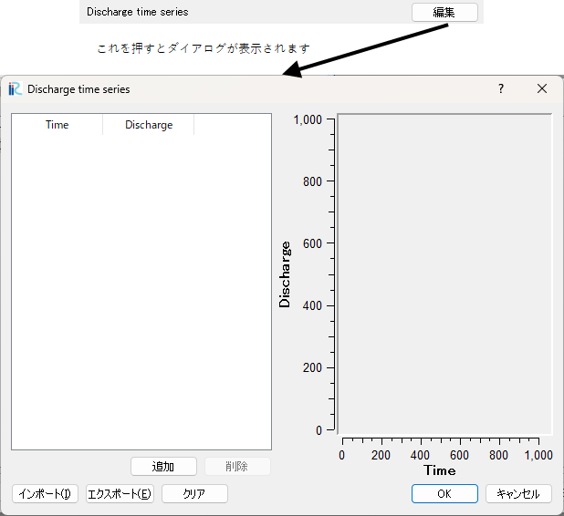

.. _cc_widget_example_func:

関数型
===========

定義方法
----------

.. code-block:: xml
   :caption: 関数型の条件の定義例
   :name: widget_example_func_def
   :linenos:

   <Item name="discharge" caption="Discharge time series">
     <Definition valueType="functional" >
       <Parameter valueType="real" caption="Time" />
       <Value valueType="real" caption="Discharge" />
     </Definition>
   </Item>

条件の表示例
---------------

.. _widget_example_func:

   関数型の条件の表示例

読み込み処理の記述方法
---------------------------

計算条件・格子生成条件
~~~~~~~~~~~~~~~~~~~~~~~~~~~~~

FORTRAN
''''''''''

.. code-block:: fortran
   :caption: 関数型の条件を読み込むための処理の記述例 (計算条件・格子生成条件) FORTRAN
   :name: widget_example_func_load_calccond_fortran
   :linenos:

   integer:: ier, discharge_size
   double precision, dimension(:), allocatable:: discharge_time, discharge_value

   ! サイズを調べる
   call cg_iRIC_Read_FunctionalSize(fid, "discharge", discharge_size, ier)
   ! メモリを確保
   allocate(discharge_time(discharge_size))
   allocate(discharge_value(discharge_size))
   ! 確保したメモリに値を読み込む
   call cg_iRIC_Read_Functional(fid, "discharge", discharge_time, discharge_value, ier)

C/C++
''''''''''

.. code-block:: c
   :caption: 関数型の条件を読み込むための処理の記述例 (計算条件・格子生成条件) C++
   :name: widget_example_func_load_calccond_c
   :linenos:

   integer:: ier, discharge_size
   std::vector<double> discharge_time, discharge_value;

   // サイズを調べる
   ier = cg_iRIC_Read_FunctionalSize(fid, "discharge", &discharge_size)
   // メモリを確保
   discharge_time.assign(discharge_size, 0);
   discharge_value.assign(discharge_size, 0);
   // 確保したメモリに値を読み込む
   ier = cg_iRIC_Read_Functional(fid, "discharge", discharge_time.data(), discharge_value.data())

Python
''''''''''

.. code-block:: python
   :caption: 関数型の条件を読み込むための処理の記述例 (計算条件・格子生成条件) Python
   :name: widget_example_func_load_calccond_python
   :linenos:

   discharge_time, discharge_value = cg_iRIC_Read_Functional(fid, "discharge")

境界条件
~~~~~~~~~~

FORTRAN
''''''''''

.. code-block:: fortran
   :caption: 関数型の条件を読み込むための処理の記述例 (境界条件) FORTRAN
   :name: widget_example_func_load_bcond_fortran
   :linenos:

   integer:: ier, discharge_size
   double precision, dimension(:), allocatable:: discharge_time, discharge_value

   ! サイズを調べる
   call cg_iRIC_Read_BC_FunctionalSize(fid, "inflow", 1, "discharge", discharge_size, ier)
   ! メモリを確保
   allocate(discharge_time(discharge_size))
   allocate(discharge_value(discharge_size))
   ! 確保したメモリに値を読み込む
   call cg_iRIC_Read_BC_Functional(fid, "inflow", 1, "discharge", discharge_time, discharge_value, ier)

C/C++
''''''''''

.. code-block:: c
   :caption: 関数型の条件を読み込むための処理の記述例 (境界条件) C++
   :name: widget_example_func_load_bcond_c
   :linenos:

   integer:: ier, discharge_size
   std::vector<double> discharge_time, discharge_value;

   // サイズを調べる
   ier = cg_iRIC_Read_BC_FunctionalSize(fid, "inflow", 1, "discharge", &discharge_size)
   // メモリを確保
   discharge_time.assign(discharge_size, 0);
   discharge_value.assign(discharge_size, 0);
   // 確保したメモリに値を読み込む
   ier = cg_iRIC_Read_BC_Functional(fid, "inflow", 1, "discharge", discharge_time.data(), discharge_value.data());

Python
''''''''''

.. code-block:: python
   :caption: 関数型の条件を読み込むための処理の記述例 (境界条件) Python
   :name: widget_example_func_load_bcond_python
   :linenos:

   discharge_time, discharge_value = cg_iRIC_Read_BC_Functional(fid, "inflow", 1, "discharge")
