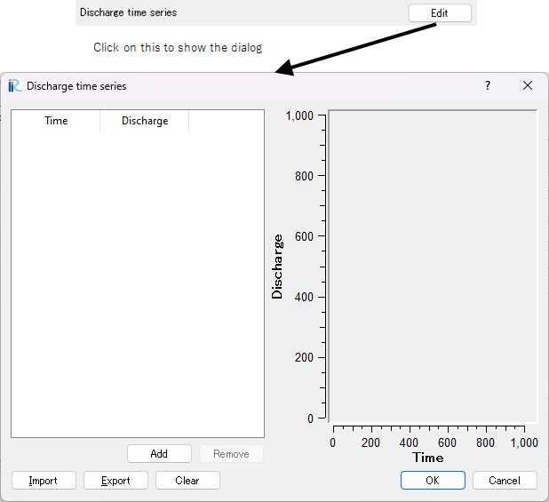

.. _cc_widget_example_func:

Functional
=============

Definition
-------------

.. code-block:: xml
   :caption: Example of a functional type condition definition
   :name: widget_example_func_def
   :linenos:

   <Item name="discharge" caption="Discharge time series">
     <Definition valueType="functional" >
       <Parameter valueType="real" caption="Time" />
       <Value valueType="real" caption="Discharge" />
     </Definition>
   </Item>

Example of widget
------------------------

.. _widget_example_func:

   Widget example of a functional type condition

Example code to read data
------------------------------

Calculation condition, Grid generating condition
~~~~~~~~~~~~~~~~~~~~~~~~~~~~~~~~~~~~~~~~~~~~~~~~~~~~~

FORTRAN
'''''''''''

.. code-block:: fortran
   :caption: Code example to functional type condition (for calculation conditions and grid generating conditions) FORTRAN
   :name: widget_example_func_load_calccond_fortran
   :linenos:

   integer:: ier, discharge_size
   double precision, dimension(:), allocatable:: discharge_time, discharge_value

   ! Read size
   call cg_iRIC_Read_FunctionalSize(fid, "discharge", discharge_size, ier)
   ! Allocate memory
   allocate(discharge_time(discharge_size))
   allocate(discharge_value(discharge_size))
   ! Load values into the allocated memory
   call cg_iRIC_Read_Functional(fid, "discharge", discharge_time, discharge_value, ier)

C/C++
''''''''''

.. code-block:: c
   :caption: Code example to functional type condition (for calculation conditions and grid generating conditions) C++
   :name: widget_example_func_load_calccond_c
   :linenos:

   integer:: ier, discharge_size
   std::vector<double> discharge_time, discharge_value;

   // Read size
   ier = cg_iRIC_Read_FunctionalSize(fid, "discharge", &discharge_size)
   // Allocate memory
   discharge_time.assign(discharge_size, 0);
   discharge_value.assign(discharge_size, 0);
   // Load values into the allocated memory
   ier = cg_iRIC_Read_Functional(fid, "discharge", discharge_time.data(), discharge_value.data())

Python
''''''''''

.. code-block:: python
   :caption: Code example to functional type condition (for calculation conditions and grid generating conditions) Python
   :name: widget_example_func_load_calccond_python
   :linenos:

   discharge_time, discharge_value = cg_iRIC_Read_Functional(fid, "discharge")

Boundary condition
~~~~~~~~~~~~~~~~~~~~~~~

FORTRAN
''''''''''

.. code-block:: fortran
   :caption: Code example to functional type condition (for boundary conditions) FORTRAN
   :name: widget_example_func_load_bcond_fortran
   :linenos:

   integer:: ier, discharge_size
   double precision, dimension(:), allocatable:: discharge_time, discharge_value

   ! Read size
   call cg_iRIC_Read_BC_FunctionalSize(fid, "inflow", 1, "discharge", discharge_size, ier)
   ! Allocate memory
   allocate(discharge_time(discharge_size))
   allocate(discharge_value(discharge_size))
   ! Load values into the allocated memory
   call cg_iRIC_Read_BC_Functional(fid, "inflow", 1, "discharge", discharge_time, discharge_value, ier)

C/C++
''''''''''

.. code-block:: c
   :caption: Code example to functional type condition (for boundary conditions) C++
   :name: widget_example_func_load_bcond_c
   :linenos:

   integer:: ier, discharge_size
   std::vector<double> discharge_time, discharge_value;

   // Read size
   ier = cg_iRIC_Read_BC_FunctionalSize(fid, "inflow", 1, "discharge", &discharge_size)
   // Allocate memory
   discharge_time.assign(discharge_size, 0);
   discharge_value.assign(discharge_size, 0);
   // Load values into the allocated memory
   ier = cg_iRIC_Read_BC_Functional(fid, "inflow", 1, "discharge", discharge_time.data(), discharge_value.data());

Python
''''''''''

.. code-block:: python
   :caption: Code example to functional type condition (for boundary conditions) Python
   :name: widget_example_func_load_bcond_python
   :linenos:

   discharge_time, discharge_value = cg_iRIC_Read_BC_Functional(fid, "inflow", 1, "discharge")
