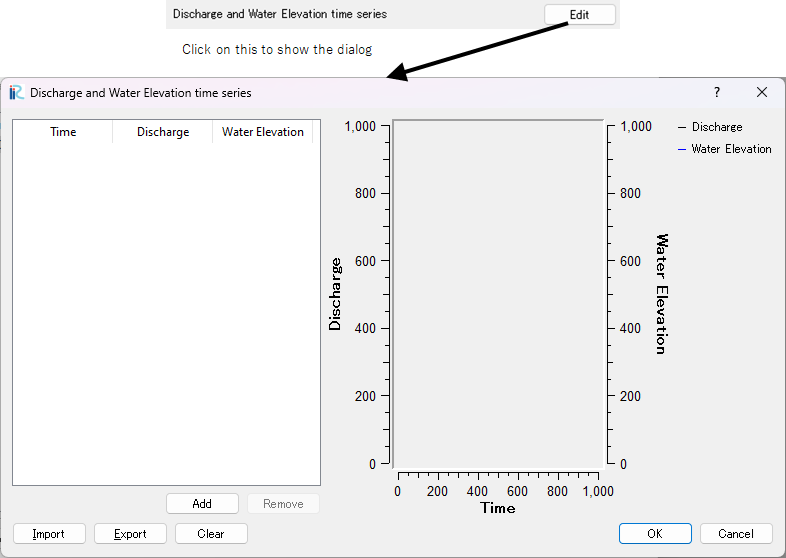

Functional (with multiple values)
=====================================

Definition
-------------

.. code-block:: xml
   :caption: Example of a functional (with multiple values) type condition definition
   :name: widget_example_func_multi_def
   :linenos:

   <Item name="discharge_and_elev" caption="Discharge and Water Elevation time series">
     <Definition valueType="functional" >
       <Parameter name="time" valueType="real" caption="Time" />
       <Value name="discharge" valueType="real" caption="Discharge" />
       <Value name="elevation" valueType="real" caption="Water Elevation" />
     </Definition>
   </Item>

Example of widget
------------------------

.. _widget_example_func_multi:

   Widget example of a functional (with multiple values) type condition

Example code to read data
------------------------------

Calculation condition, Grid generating condition
~~~~~~~~~~~~~~~~~~~~~~~~~~~~~~~~~~~~~~~~~~~~~~~~~~~~~

FORTRAN
'''''''''''

.. code-block:: fortran
   :caption: Code example to load a functional (with multiple values) type condition (for calculation conditions and grid generating conditions) FORTRAN
   :name: widget_example_func_multi_load_calccond_fortran
   :linenos:

   integer:: ier, discharge_size
   double precision, dimension(:), allocatable:: time_value
   double precision, dimension(:), allocatable:: discharge_value, elevation_value

   ! Read size
   call cg_iRIC_Read_FunctionalSize(fid, "discharge", discharge_size, ier)
   ! Allocate memory
   allocate(time_value(discharge_size))
   allocate(discharge_value(discharge_size), elevation_value(discharge_size))
   ! Load values into allocated memory
   call cg_iRIC_Read_FunctionalWithName(fid, "discharge", "time", time_value, ier)
   call cg_iRIC_Read_FunctionalWithName(fid, "discharge", "discharge", discharge_value, ier)
   call cg_iRIC_Read_FunctionalWithName(fid, "discharge", "elevation", elevation_value, ier)

C/C++
''''''''''

.. code-block:: c
   :caption: Code example to load a functional (with multiple values) type condition (for calculation conditions and grid generating conditions) C++
   :name: widget_example_func_multi_load_calccond_c
   :linenos:

   int ier, discharge_size;
   std::vector<double> time_value, discharge_value, elevation_value;

   // Read size
   ier = cg_iRIC_Read_FunctionalSize(fid, "discharge", &discharge_size);
   // Allocate memory
   time_value.assign(discharge_size, 0);
   discharge_value.assign(discharge_size, 0);
   elevation_value.assign(discharge_size, 0);
   // Load values into allocated memory
   ier = cg_iRIC_Read_FunctionalWithName(fid, "discharge", "time", time_value);
   ier = cg_iRIC_Read_FunctionalWithName(fid, "discharge", "discharge", discharge_value);
   ier = cg_iRIC_Read_FunctionalWithName(fid, "discharge", "elevation", elevation_value);

Python
''''''''''

.. code-block:: python
   :caption: Code example to load a functional (with multiple values) type condition (for calculation conditions and grid generating conditions) Python
   :name: widget_example_func_multi_load_calccond_python
   :linenos:

   time_value = cg_iRIC_Read_FunctionalWithName(fid, "discharge", "time")
   discharge_value = cg_iRIC_Read_FunctionalWithName(fid, "discharge", "discharge")
   elevation_value = cg_iRIC_Read_FunctionalWithName(fid, "discharge", "elevation")

Boundary condition
~~~~~~~~~~~~~~~~~~~~~~~

FORTRAN
''''''''''

.. code-block:: fortran
   :caption: Code example to load a functional (with multiple values) type condition (for boundary conditions) FORTRAN
   :name: widget_example_func_multi_load_bcond_fortran
   :linenos:

   integer:: ier, discharge_size
   double precision, dimension(:), allocatable:: time_value
   double precision, dimension(:), allocatable:: discharge_value, elevation_value

   ! Read size
   call cg_iRIC_Read_BC_FunctionalSize(fid, "discharge", discharge_size, ier)
   ! Allocate memory
   allocate(time_value(discharge_size))
   allocate(discharge_value(discharge_size), elevation_value(discharge_size))
   ! Load values into allocated memory
   call cg_iRIC_Read_BC_FunctionalWithName(fid, "discharge", "time", time_value, ier)
   call cg_iRIC_Read_BC_FunctionalWithName(fid, "discharge", "discharge", discharge_value, ier)
   call cg_iRIC_Read_BC_FunctionalWithName(fid, "discharge", "elevation", elevation_value, ier)

C/C++
''''''''''

.. code-block:: c
   :caption: Code example to load a functional (with multiple values) type condition (for boundary conditions) C/C++
   :name: widget_example_func_multi_load_bcond_c
   :linenos:

   int ier, discharge_size;
   std::vector<double> time_value, discharge_value, elevation_value;

   // Read size
   ier = cg_iRIC_Read_BC_FunctionalSize(fid, "discharge", &discharge_size)
   // Allocate memory
   time_value.assign(discharge_size, 0);
   discharge_value.assign(discharge_size, 0);
   elevation_value.assign(discharge_size, 0);
   // Load values into allocated memory
   ier = cg_iRIC_Read_BC_FunctionalWithName(fid, "discharge", "time", time_value.data());
   ier = cg_iRIC_Read_BC_FunctionalWithName(fid, "discharge", "discharge", discharge_value.data());
   ier = cg_iRIC_Read_BC_FunctionalWithName(fid, "discharge", "elevation", elevation_value.data());

Python
''''''''''

.. code-block:: python
   :caption: Code example to load a functional (with multiple values) type condition (for boundary conditions) Python
   :name: widget_example_func_multi_load_bcond_python
   :linenos:

   time_value = cg_iRIC_Read_BC_FunctionalWithName(fid, "discharge", "time")
   discharge_value = cg_iRIC_Read_BC_FunctionalWithName(fid, "discharge", "discharge")
   elevation_value = cg_iRIC_Read_BC_FunctionalWithName(fid, "discharge", "elevation")
