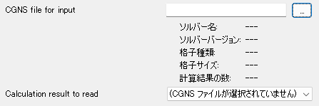

CGNSファイル名 など
=======================

概要
--------

CGNSファイル名と、CGNSファイル内の計算結果は組み合わせて使用します。

CGNSファイル名の入力欄は、 valueType に cgns_filename を指定することで作成できます。

CGNSファイル内の計算結果は、 valueType に result_gridNodeReal などを指定し、 cgnsFile に CGNSファイル名の入力欄に指定した name を指定することで作成できます。

定義方法
----------

.. code-block:: xml
   :caption: CGNSファイル名とCGNSファイル内の計算結果の条件の定義例
   :name: widget_example_cgns_def
   :linenos:

   <Item name="input_file" caption="CGNS file for input">
     <Definition valueType="cgns_filename" />
   </Item>
   <Item name="result_to_read" caption="Calculation result to read">
     <Definition valueType="result_gridNodeReal" cgnsFile="input_file" />
   </Item>

条件の表示例
---------------

.. _widget_example_cgns:

   CGNSファイル名とCGNSファイル内の計算結果の条件の表示例

読み込み処理の記述方法
---------------------------

計算条件・格子生成条件
~~~~~~~~~~~~~~~~~~~~~~~~~~~~~

FORTRAN
''''''''''

.. code-block:: fortran
   :caption: CGNSファイル名と計算結果の条件を読み込むための処理の記述例 (計算条件・格子生成条件) FORTRAN
   :name: widget_example_cgns_load_calccond_fortran
   :linenos:

   integer:: ier
   character(200):: cgnsName, resultName

   call cg_iRIC_Read_String(fid, "input_file", cgnsName, ier)
   call cg_iRIC_Read_String(fid, "result_to_read", resultName, ier)

C/C++
''''''''''

.. code-block:: c
   :caption: CGNSファイル名と計算結果の条件を読み込むための処理の記述例 (計算条件・格子生成条件) C/C++
   :name: widget_example_cgns_load_calccond_c
   :linenos:

   int ier;
   char cgnsName[200], resultName[200];

   ier = cg_iRIC_Read_String(fid, "input_file", cgnsName);
   ier = cg_iRIC_Read_String(fid, "result_to_read", resultName);

Python
''''''''''

.. code-block:: python
   :caption: CGNSファイル名と計算結果の条件を読み込むための処理の記述例 (計算条件・格子生成条件) Python
   :name: widget_example_cgns_load_calccond_python
   :linenos:

   cgnsName = cg_iRIC_Read_String(fid, "input_file")
   resultName = cg_iRIC_Read_String(fid, "result_to_read")

境界条件
~~~~~~~~~~

FORTRAN
''''''''''

.. code-block:: fortran
   :caption: CGNSファイル名と計算結果の条件を読み込むための処理の記述例 (境界条件) FORTRAN
   :name: widget_example_cgns_load_bcond_fortran
   :linenos:

   integer:: ier
   character(200):: cgnsName, resultName

   call cg_iRIC_Read_BC_String(fid, "inflow", 1, "input_file", cgnsName, ier)
   call cg_iRIC_Read_BC_String(fid, "inflow", 1, "result_to_read", resultName, ier)

C/C++
''''''''''

.. code-block:: c
   :caption: CGNSファイル名と計算結果の条件を読み込むための処理の記述例 (境界条件) C/C++
   :name: widget_example_cgns_load_bcond_c
   :linenos:

   int ier;
   char cgnsName[200], resultName[200];

   ier = cg_iRIC_Read_BC_String(fid, "inflow", 1, "input_file", cgnsName)
   ier = cg_iRIC_Read_BC_String(fid, "inflow", 1, "result_to_read", resultName)

Python
''''''''''

.. code-block:: python
   :caption: CGNSファイル名と計算結果の条件を読み込むための処理の記述例 (境界条件) Python
   :name: widget_example_cgns_load_bcond_python
   :linenos:

   cgnsName = cg_iRIC_Read_BC_String(fid, "inflow", 1, "input_file")
   resultName = cg_iRIC_Read_BC_String(fid, "inflow", 1, "result_to_read")

計算結果の種類ごとの valueType の値の一覧
---------------------------------------------

計算結果の種類ごとの valueType の値の一覧を :numref:`cgns_resulttype_table` に示します。

.. list-table:: 計算結果の種類ごとの valueType 一覧
   :name: cgns_resulttype_table
   :header-rows: 1
   
   * - 定義位置
     - 値の型
     - valueType

   * - グローバル
     - 実数
     - result_baseIterativeReal

   * - グローバル
     - 整数
     - result_baseIterativeInteger

   * - 格子点
     - 実数
     - result_gridNodeReal

   * - 格子点
     - 整数
     - result_gridNodeInteger

   * - セル
     - 実数
     - result_gridCellReal

   * - セル
     - 整数
     - result_gridCellInteger

   * - 格子の辺 (I方向)
     - 実数
     - result_gridEdgeIReal

   * - 格子の辺 (I方向)
     - 整数
     - result_gridEdgeIInteger

   * - 格子の辺 (J方向)
     - 実数
     - result_gridEdgeJReal

   * - 格子の辺 (J方向)
     - 整数
     - result_gridEdgeJInteger
