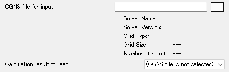

CGNS file name etc.
==========================

Abstract
-----------------

"CGNS file name" and "Calculation result in CGNS file" is used together.

Widget to select CGNS file name can be created with valueType attribute "cgns_filename".

Widget to select calculation result in CGNS file can be created with valueType attribute "result_gridNodeReal" etc., and 
cgnsFile attribute that refers the name of "CGNS file name" widget.

Definition
-----------------

.. code-block:: xml
   :caption: Example of a CGNS file name and Calculation result in CGNS
   :name: widget_example_cgns_def
   :linenos:

   <Item name="input_file" caption="CGNS file for input">
     <Definition valueType="cgns_filename" />
   </Item>
   <Item name="result_to_read" caption="Calculation result to read">
     <Definition valueType="result_gridNodeReal" cgnsFile="input_file" />
   </Item>

Example of widget
------------------------

.. _widget_example_cgns:

   Widget example of CGNS file name and Calculation result in CGNS

Example code to read data
------------------------------

Calculation condition, Grid generating condition
~~~~~~~~~~~~~~~~~~~~~~~~~~~~~~~~~~~~~~~~~~~~~~~~~~~~~

FORTRAN
'''''''''''

.. code-block:: fortran
   :caption: Code example to load CGNS file name and Calculation result in CGNS (for calculation conditions and grid generating conditions) FORTRAN
   :name: widget_example_cgns_load_calccond_fortran
   :linenos:

   integer:: ier
   character(200):: cgnsName, resultName

   call cg_iRIC_Read_String(fid, "input_file", cgnsName, ier)
   call cg_iRIC_Read_String(fid, "result_to_read", resultName, ier)

C/C++
''''''''''

.. code-block:: c
   :caption: Code example to load CGNS file name and Calculation result in CGNS (for calculation conditions and grid generating conditions) C/C++
   :name: widget_example_cgns_load_calccond_c
   :linenos:

   int ier;
   char cgnsName[200], resultName[200];

   ier = cg_iRIC_Read_String(fid, "input_file", cgnsName);
   ier = cg_iRIC_Read_String(fid, "result_to_read", resultName);

Python
''''''''''

.. code-block:: python
   :caption: Code example to load CGNS file name and Calculation result in CGNS (for calculation conditions and grid generating conditions) Python
   :name: widget_example_cgns_load_calccond_python
   :linenos:

   cgnsName = cg_iRIC_Read_String(fid, "input_file")
   resultName = cg_iRIC_Read_String(fid, "result_to_read")

Boundary condition
~~~~~~~~~~~~~~~~~~~~~~~~

FORTRAN
''''''''''

.. code-block:: fortran
   :caption: Code example to load CGNS file name and Calculation result in CGNS (for boundary conditions) FORTRAN
   :name: widget_example_cgns_load_bcond_fortran
   :linenos:

   integer:: ier
   character(200):: cgnsName, resultName

   call cg_iRIC_Read_BC_String(fid, "inflow", 1, "input_file", cgnsName, ier)
   call cg_iRIC_Read_BC_String(fid, "inflow", 1, "result_to_read", resultName, ier)

C/C++
''''''''''

.. code-block:: c
   :caption: Code example to load CGNS file name and Calculation result in CGNS (for boundary conditions) C/C++
   :name: widget_example_cgns_load_bcond_c
   :linenos:

   int ier;
   char cgnsName[200], resultName[200];

   ier = cg_iRIC_Read_BC_String(fid, "inflow", 1, "input_file", cgnsName)
   ier = cg_iRIC_Read_BC_String(fid, "inflow", 1, "result_to_read", resultName)

Python
''''''''''

.. code-block:: python
   :caption: Code example to load CGNS file name and Calculation result in CGNS (for boundary conditions) Python
   :name: widget_example_cgns_load_bcond_python
   :linenos:

   cgnsName = cg_iRIC_Read_BC_String(fid, "inflow", 1, "input_file")
   resultName = cg_iRIC_Read_BC_String(fid, "inflow", 1, "result_to_read")

Calculation result types and corresponding "valueType" values
--------------------------------------------------------------------

The list of calculation result types and corresponding "valueType" values are shown in :numref:`cgns_resulttype_table`.

.. list-table:: The list of calculation result type and "valueType"
   :name: cgns_resulttype_table
   :header-rows: 1
   
   * - Definition position
     - Value type
     - Value of "valueType" attribute

   * - Global
     - Real
     - result_baseIterativeReal

   * - Global
     - Integer
     - result_baseIterativeInteger

   * - Grid Node
     - Real
     - result_gridNodeReal

   * - Grid Node
     - Integer
     - result_gridNodeInteger

   * - Grid Cell
     - Real
     - result_gridCellReal

   * - Grid Cell
     - Integer
     - result_gridCellInteger

   * - Grid Edge (I direction)
     - Real
     - result_gridEdgeIReal

   * - Grid Edge (I direction)
     - Integer
     - result_gridEdgeIInteger

   * - Grid Edge (J direction)
     - Real
     - result_gridEdgeJReal

   * - Grid Edge (J direction)
     - Integer
     - result_gridEdgeJInteger
