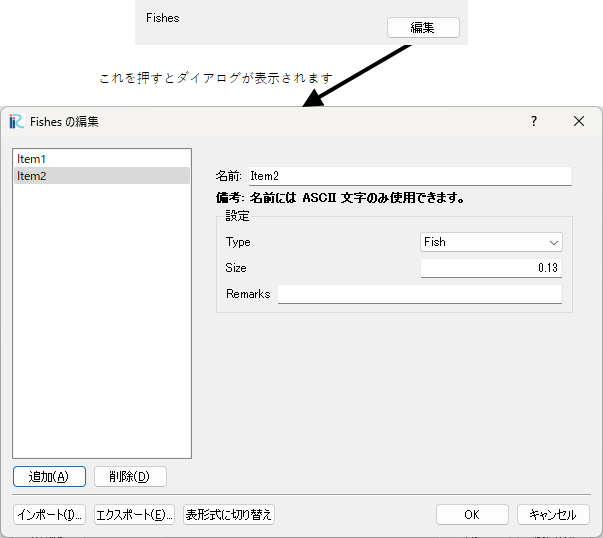

複合型
==========

概要
--------

複合型は、ここまでで説明してきた、文字列、整数、実数などの条件を複数組み合わせたものです。

valueType に complex を指定した \<Definition\> 要素を作成し、その内側に整数型、実数型などの
条件を定義します。

定義方法
----------

.. code-block:: xml
   :caption: 複合型の条件の定義例
   :name: widget_example_complex_def
   :linenos:

   <Item name="fish" caption="Fishes">
     <Definition valueType="complex" >
       <Item name="type" caption="Type">
         <Definition valueType="integer" option="true" default="1">
           <Enumerations>
             <Enumeration value="1" caption="Fish"/>
             <Enumeration value="2" caption="Crub"/>
             <Enumeration value="3" caption="Shrimp"/>
           </Enumerations>
         </Definition>
       </Item>
       <Item name="size" caption="Size">
         <Definition valueType="real" default="0.13" />
       </Item>
       <Item name="remarks" caption="Remarks">
         <Definition valueType="string" default="" />
       </Item>
     </Definition>
   </Item>

条件の表示例
---------------

.. _widget_example_complex:

   複合型の条件の表示例

読み込み処理の記述方法
---------------------------

計算条件・格子生成条件
~~~~~~~~~~~~~~~~~~~~~~~~~~~~~

FORTRAN
''''''''''

.. code-block:: fortran
   :caption: 複合型の条件を読み込むための処理の記述例 (計算条件・格子生成条件) FORTRAN
   :name: widget_example_complex_load_calccond_fortran
   :linenos:

   integer:: ier, fish_count
   integer, dimension(:), allocatable:: fish_type
   double precision, dimension(:), allocatable:: fish_size
   character(200), dimension(:), allocatable:: fish_remarks
   integer:: i

   ! サイズを調べる
   call cg_iRIC_Read_Complex_Count(fid, "fish", fish_count, ier)
   ! メモリを確保
   allocate(fish_type(fish_count))
   allocate(fish_size(fish_count))
   allocate(fish_remarks(fish_count))
   ! 確保したメモリに値を読み込む
   do i = 1, fish_count
     call cg_iRIC_Read_Complex_Integer(fid, "fish", "type", fish_type(i), ier)
     call cg_iRIC_Read_Complex_Real(fid, "fish", "size", fish_size(i), ier)
     call cg_iRIC_Read_Complex_String(fid, "fish", "remarks", fish_remarks(i), ier)
   end do

C/C++
''''''''''

.. code-block:: c
   :caption: 複合型の条件を読み込むための処理の記述例 (計算条件・格子生成条件) C++
   :name: widget_example_complex_load_calccond_c
   :linenos:

   int ier, fish_count;
   std::vector<int> fish_type;
   std::vector<double> fish_size;
   int strlen;
   std::vector<std::vector<char> > fish_remarks;

   // サイズを調べる
   ier = cg_iRIC_Read_Complex_Count(fid, "fish", &fish_count)
   // メモリを確保
   fish_type.assign(fish_count, 0);
   fish_size.assign(fish_count, 0);
   fish_remarks.assign(fish_count, "");
   // 確保したメモリに値を読み込む
   for (int i = 0; i < fish_count; ++i) {
     ier = cg_iRIC_Read_Complex_Integer(fid, "fish", "type", &fish_type[i]);
     call cg_iRIC_Read_Complex_Real(fid, "fish", "size", &fish_size[i]);
     auto& remarks = fish_remarks[i];
     call cg_iRIC_Read_Complex_StringLen(fid, "fish", "remarks", &strlen);
     remarks.assign(strlen + 1, 0);
     call cg_iRIC_Read_Complex_String(fid, "fish", "remarks", remarks.data());
   }

Python
''''''''''

.. code-block:: python
   :caption: 複合型の条件を読み込むための処理の記述例 (計算条件・格子生成条件) Python
   :name: widget_example_complex_load_calccond_python
   :linenos:

   # サイズを調べる
   fish_count = cg_iRIC_Read_Complex_Count(fid, "fish")
   # リストを用意
   fish_type = list()
   fish_size = list()
   fish_remarks = list()

   for i in range(fish_count):
     fish_type.append(cg_iRIC_Read_Complex_Integer(fid, "fish", "type"))
     fish_size.append(cg_iRIC_Read_Complex_Real(fid, "fish", "size"))
     fish_remarks.append(cg_iRIC_Read_Complex_String(fid, "fish", "remarks"))
