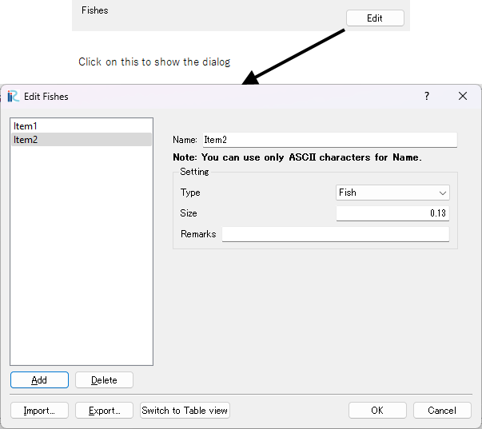

Complex type
================

Abstract
-----------

A complex type is a combination of several of the conditions described before, such as string, integer, and real number.

Definition
---------------

.. code-block:: xml
   :caption: Example of a complex type condition definition
   :name: widget_example_complex_def
   :linenos:

   <Item name="fish" caption="Fishes">
     <Definition valueType="complex" >
       <Item name="type" caption="Type">
         <Definition valueType="integer" option="true" default="1">
           <Enumerations>
             <Enumeration value="1" caption="Fish"/>
             <Enumeration value="2" caption="Crub"/>
             <Enumeration value="3" caption="Shrimp"/>
           </Enumerations>
         </Definition>
       </Item>
       <Item name="size" caption="Size">
         <Definition valueType="real" default="0.13" />
       </Item>
       <Item name="remarks" caption="Remarks">
         <Definition valueType="string" default="" />
       </Item>
     </Definition>
   </Item>

Example of widget
------------------------

.. _widget_example_complex:

   Widget example of Complex type

Example code to read data
------------------------------

Calculation condition, Grid generating condition
~~~~~~~~~~~~~~~~~~~~~~~~~~~~~~~~~~~~~~~~~~~~~~~~~~~~~

FORTRAN
''''''''''

.. code-block:: fortran
   :caption: Code example to load complex type condition (for calculation conditions and grid generating conditions) FORTRAN
   :name: widget_example_complex_load_calccond_fortran
   :linenos:

   integer:: ier, fish_count
   integer, dimension(:), allocatable:: fish_type
   double precision, dimension(:), allocatable:: fish_size
   character(200), dimension(:), allocatable:: fish_remarks
   integer:: i

   ! Read size
   call cg_iRIC_Read_Complex_Count(fid, "fish", fish_count, ier)
   ! Allocate memory
   allocate(fish_type(fish_count))
   allocate(fish_size(fish_count))
   allocate(fish_remarks(fish_count))
   ! Load values into the allocated memory
   do i = 1, fish_count
     call cg_iRIC_Read_Complex_Integer(fid, "fish", i, "type", fish_type(i), ier)
     call cg_iRIC_Read_Complex_Real(fid, "fish", i, "size", fish_size(i), ier)
     call cg_iRIC_Read_Complex_String(fid, "fish", i, "remarks", fish_remarks(i), ier)
   end do

C/C++
''''''''''

.. code-block:: c
   :caption: Code example to load complex type condition (for calculation conditions and grid generating conditions) C++
   :name: widget_example_complex_load_calccond_c
   :linenos:

   int ier, fish_count;
   std::vector<int> fish_type;
   std::vector<double> fish_size;
   int strlen;
   std::vector<std::vector<char> > fish_remarks;

   // Read size
   ier = cg_iRIC_Read_Complex_Count(fid, "fish", &fish_count)
   // Allocate memory
   fish_type.assign(fish_count, 0);
   fish_size.assign(fish_count, 0);
   fish_remarks.assign(fish_count, "");
   // Load values into the allocated memory
   for (int i = 0; i < fish_count; ++i) {
     ier = cg_iRIC_Read_Complex_Integer(fid, "fish", i + 1, "type", &fish_type[i]);
     call cg_iRIC_Read_Complex_Real(fid, "fish", i + 1, "size", &fish_size[i]);
     auto& remarks = fish_remarks[i];
     call cg_iRIC_Read_Complex_StringLen(fid, "fish", i + 1, "remarks", &strlen);
     remarks.assign(strlen + 1, 0);
     call cg_iRIC_Read_Complex_String(fid, "fish", i + 1, "remarks", remarks.data());
   }

Python
''''''''''

.. code-block:: python
   :caption: Code example to load complex type condition (for calculation conditions and grid generating conditions) Python
   :name: widget_example_complex_load_calccond_python
   :linenos:

   # Read size
   fish_count = cg_iRIC_Read_Complex_Count(fid, "fish")
   # Prepare list
   fish_type = list()
   fish_size = list()
   fish_remarks = list()

   for i in range(fish_count):
     fish_type.append(cg_iRIC_Read_Complex_Integer(fid, "fish", i + 1, "type"))
     fish_size.append(cg_iRIC_Read_Complex_Real(fid, "fish", i + 1, "size"))
     fish_remarks.append(cg_iRIC_Read_Complex_String(fid, "fish", i + 1, "remarks"))

Reading name
-----------------

Name of items of Complex type (for example, "Item2" in case of :numref:`widget_example_complex`) can be read using
cg_iRIC_Read_Complex_String, specifying "_caption" as argument "name".

Please refer to :ref:`sec_ref_cg_iRIC_Read_Complex_String` for detailed description about arguments.
