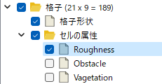

実数
=====

定義方法
----------

.. code-block:: xml
   :caption: 実数の格子属性の定義例
   :name: grid_att_example_real_def
   :linenos:

   <Item name="roughness" caption="Roughness">
     <Definition valueType="real" position="cell" />
   </Item>

条件の表示例
---------------

.. _grid_att_example_real_object_browser:

   セルで定義された実数の条件のオブジェクトブラウザでの表示例

.. _grid_att_example_real_edit_dialog:

   セルで定義された実数の条件の編集ダイアログ表示例

読み込み処理の記述方法
---------------------------

FORTRAN
''''''''''

.. code-block:: fortran
   :caption: セルで定義された実数の格子属性を読み込むための処理の記述例 FORTRAN
   :name: grid_att_example_real_load_fortran
   :linenos:

   integer:: ier, cellcount
   double precision, dimension(:), allocatable:: roughness

   ! サイズを調べる
   call cg_iRIC_Read_Grid_CellCount(fid, cellcount, ier)
   ! メモリを確保
   allocate(roughness(cellcount))
   ! 確保したメモリに値を読み込む
   call cg_iRIC_Read_Grid_Real_Cell(fid, "roughness", roughness, ier)

C/C++
'''''''

.. code-block:: c
   :caption: セルで定義された実数の格子属性を読み込むための処理の記述例 C++
   :name: grid_att_example_real_load_c
   :linenos:

   int ier, cellcount;
   std::vector<double> roughness;

   // サイズを調べる
   ier = cg_iRIC_Read_Grid_CellCount(fid, &cellcount);
   // メモリを確保
   roughness.assign(cellcout, 0);
   // 確保したメモリに値を読み込む
   ier = cg_iRIC_Read_Grid_Real_Cell(fid, "roughness", roughness.data());

Python
'''''''

.. code-block:: python
   :caption: セルで定義された実数の格子属性を読み込むための処理の記述例 Python
   :name: grid_att_example_real_load_python
   :linenos:

   roughness = cg_iRIC_Read_Grid_Real_Cell(fid, "roughness")
