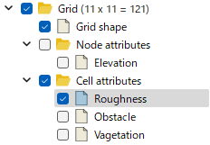

Real number
================

Definition
-------------

.. code-block:: xml
   :caption: Example of a real number type grid attribute
   :name: grid_att_example_real_def
   :linenos:

   <Item name="roughness" caption="Roughness">
     <Definition valueType="real" position="cell" />
   </Item>

Display example
-------------------

.. _grid_att_example_real_object_browser:

   Example of real number type grid attribute defined at cells

.. _grid_att_example_real_edit_dialog:

   Dialog to edit value of real number type grid attribute defined at cells

Example code to read data
---------------------------

FORTRAN
''''''''''

.. code-block:: fortran
   :caption: Code example to load a real number type grid attribute defined at cells FORTRAN
   :name: grid_att_example_real_load_fortran
   :linenos:

   integer:: ier, cellcount
   double precision, dimension(:), allocatable:: roughness

   ! Read size
   call cg_iRIC_Read_Grid_CellCount(fid, cellcount, ier)
   ! Allocate memory
   allocate(roughness(cellcount))
   ! Load values into the allocated memory
   call cg_iRIC_Read_Grid_Real_Cell(fid, "roughness", roughness, ier)

C/C++
'''''''

.. code-block:: c
   :caption: Code example to load a real number type grid attribute defined at cells C++
   :name: grid_att_example_real_load_c
   :linenos:

   int ier, cellcount;
   std::vector<double> roughness;

   // Read size
   ier = cg_iRIC_Read_Grid_CellCount(fid, &cellcount);
   // Allocate memory
   roughness.assign(cellcout, 0);
   // Load values into the allocated memory
   ier = cg_iRIC_Read_Grid_Real_Cell(fid, "roughness", roughness.data());

Python
'''''''

.. code-block:: python
   :caption: Code example to load a real number type grid attribute defined at cells Python
   :name: grid_att_example_real_load_python
   :linenos:

   roughness = cg_iRIC_Read_Grid_Real_Cell(fid, "roughness")
