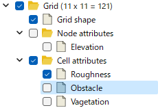
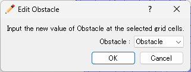

Integer
===========

Definition
-------------

.. code-block:: xml
   :caption: Example of a integer type grid attribute
   :name: grid_att_example_int_def
   :linenos:

   <Item name="obst" caption="Obstacle">
     <Definition valueType="integer" position="cell">
       <Enumeration value="0" caption="Normal cell" />
       <Enumeration value="1" caption="Obstacle" />
     </Definition>
   </Item>

Display example
-------------------

.. _grid_att_example_int_object_browser:

   Example of integer type grid attribute defined at cells

.. _grid_att_example_int_edit_dialog:

   Dialog to edit value of integer type grid attribute defined at cells

Example code to read data
---------------------------

FORTRAN
''''''''''

.. code-block:: fortran
   :caption: Code example to load a integer type grid attribute defined at cells FORTRAN
   :name: grid_att_example_int_load_fortran
   :linenos:

   integer:: ier, cellcount
   integer, dimension(:), allocatable:: obst

   ! Read size
   call cg_iRIC_Read_Grid_CellCount(fid, cellcount, ier)
   ! Allocate memory
   allocate(roughness(cellcount))
   ! Load values into the allocated memory
   call cg_iRIC_Read_Grid_Integer_Cell(fid, "obst", obst, ier)

C/C++
'''''''

.. code-block:: c
   :caption: Code example to load a integer type grid attribute defined at cells C++
   :name: grid_att_example_int_load_c
   :linenos:

   int ier, cellcount;
   std::vector<int> obst;

   // Read size
   ier = cg_iRIC_Read_Grid_CellCount(fid, &cellcount);
   // Allocate memory
   obst.assign(cellcout, 0);
   // Load values into the allocated memory
   ier = cg_iRIC_Read_Grid_Integer_Cell(fid, "obst", obst.data());

Python
'''''''

.. code-block:: python
   :caption: Code example to load a integer type grid attribute defined at cells Python
   :name: grid_att_example_int_load_python
   :linenos:

   obst = cg_iRIC_Read_Grid_Integer_Cell(fid, "obst")
