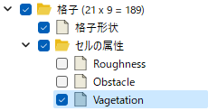
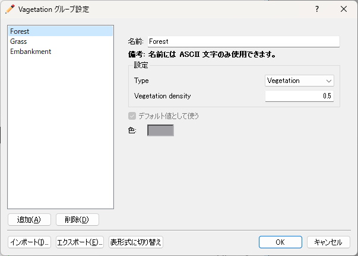

複合型
========

定義方法
----------

.. code-block:: xml
   :caption: 複合型の格子属性の定義例
   :name: grid_att_example_complex_def
   :linenos:

   <Item name="vegetation" caption="Vagetation">
     <Definition valueType="complex" position="cell">
       <Item name="type" caption="Type">
         <Definition valueType="integer" option="true" default="1">
           <Enumerations>
             <Enumeration value="0" caption="No vegetation"/>
             <Enumeration value="1" caption="Vegetation"/>
           </Enumerations>
         </Definition>
       </Item>
       <Item name="density" caption="Vegetation density">
         <Definition valueType="real" default="0">
           <Condition type="isEqual" target="type" value="1"/>
         </Definition>
       </Item>
     </Definition>
   </Item>

条件の表示例
---------------

.. _grid_att_example_complex_object_browser:

   セルで定義された複合型の条件のオブジェクトブラウザでの表示例

.. _grid_att_example_complex_edit_dialog:

   セルで定義された複合型の条件の編集ダイアログ表示例

.. _grid_att_example_complex_edit_group:

   セルで定義された複合型のグループ編集画面の表示例

読み込み処理の記述方法
---------------------------

FORTRAN
''''''''''

.. code-block:: fortran
   :caption: セルで定義された複合型の格子属性を読み込むための処理の記述例 FORTRAN
   :name: grid_att_example_complex_load_fortran
   :linenos:

   integer:: ier, cellcount, vegetation_groupcount
   integer, dimension(:), allocatable:: vegetation
   integer, dimension(:), allocatable:: vegetation_type
   double precision, dimension(:), allocatable:: vegetation_density
   integer:: i

   ! セルの数を調べる
   call cg_iRIC_Read_Grid_CellCount(fid, cellcount, ier)
   ! メモリを確保
   allocate(roughness(vegetation))
   ! 確保したメモリに各セルの値を読み込む
   call cg_iRIC_Read_Grid_Complex_Cell(fid, "vegetation", vegetation, ier)

   ! グループの数を調べる
   call cg_iRIC_Read_Complex_Count(fid, "vegetation", vegetation_groupcount, ier)
   ! メモリを確保
   allocate(vegetation_type(vegetation_groupcount))
   allocate(vegetation_density(vegetation_groupcount))
   ! 確保したメモリに値を読み込む
   do i = 1, vegetation_groupcount
     call cg_iRIC_Read_Complex_Integer(fid, "vegetation", "type", vegetation_type(i), ier)
     call cg_iRIC_Read_Complex_Real(fid, "vegetation", "density", vegetation_density(i), ier)
   end do

C/C++
'''''''

.. code-block:: c
   :caption: セルで定義された複合型の格子属性を読み込むための処理の記述例 C++
   :name: grid_att_example_complex_load_c
   :linenos:

   int ier, cellcount, vegetation_groupcount;
   std::vector<int> vegetation;
   std::vector<int> vegetation_type;
   std::vector<double> vegetation_density;

   // セルの数を調べる
   ier = cg_iRIC_Read_Grid_CellCount(fid, &cellcount);
   // メモリを確保
   vegetation.assign(cellcount, 0);
   // 確保したメモリに各セルの値を読み込む
   ier = cg_iRIC_Read_Grid_Complex_Cell(fid, "vegetation", vegetation.data());

   // グループの数を調べる
   ier = cg_iRIC_Read_Complex_Count(fid, "vegetation", &vegetation_groupcount);
   // メモリを確保
   vegetation_type.assign(vegetation_groupcount, 0);
   vegetation_density.assign(vegetation_groupcount, 0);
   // 確保したメモリに値を読み込む
   for (int i = 0; i < vegetation_groupcount; ++i) {
     ier = cg_iRIC_Read_Complex_Integer(fid, "vegetation", "type", &vegetation_type[i]);
     ier = cg_iRIC_Read_Complex_Real(fid, "vegetation", "density", &vegetation_density[i]);
   }

Python
'''''''

.. code-block:: python
   :caption: セルで定義された複合型の格子属性を読み込むための処理の記述例 Python
   :name: grid_att_example_complex_load_python
   :linenos:

   # 各セルの値を読み込む
   vegetation = cg_iRIC_Read_Grid_Complex_Cell(fid, "vegetation")

   # グループの数を調べる
   vegetation_groupcount = cg_iRIC_Read_Complex_Count(fid, "vegetation")
   # リストを用意
   vegetation_type = list()
   vegetation_density = list()

   for i in range(vegetation_groupcount):
     vegetation_type.append(cg_iRIC_Read_Complex_Integer(fid, "vegetation", "type"))
     vegetation_density.append(cg_iRIC_Read_Complex_Real(fid, "vegetation", "density"))
