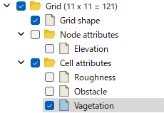
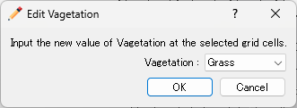
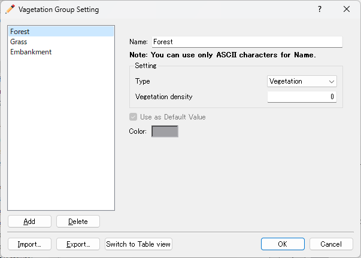

Complex Type
================

Definition
-------------

.. code-block:: xml
   :caption: Example of a complex type grid attribute
   :name: grid_att_example_complex_def
   :linenos:

   <Item name="vegetation" caption="Vagetation">
     <Definition valueType="complex" position="cell">
       <Item name="type" caption="Type">
         <Definition valueType="integer" option="true" default="1">
           <Enumerations>
             <Enumeration value="0" caption="No vegetation"/>
             <Enumeration value="1" caption="Vegetation"/>
           </Enumerations>
         </Definition>
       </Item>
       <Item name="density" caption="Vegetation density">
         <Definition valueType="real" default="0">
           <Condition type="isEqual" target="type" value="1"/>
         </Definition>
       </Item>
     </Definition>
   </Item>

Display example
-------------------

.. _grid_att_example_complex_object_browser:

   Example of complex type grid attribute defined at cells

.. _grid_att_example_complex_edit_dialog:

   Dialog to edit value of complex type grid attribute defined at cells

.. _grid_att_example_complex_edit_group:

   Dialog to edit groups of complex type grid attribute defined at cells

Example code to read data
---------------------------

FORTRAN
''''''''''

.. code-block:: fortran
   :caption: Code example to load a complex type grid attribute defined at cells FORTRAN
   :name: grid_att_example_complex_load_fortran
   :linenos:

   integer:: ier, cellcount, vegetation_groupcount
   integer, dimension(:), allocatable:: vegetation
   integer, dimension(:), allocatable:: vegetation_type
   double precision, dimension(:), allocatable:: vegetation_density
   integer:: i

   ! Read the number of cells
   call cg_iRIC_Read_Grid_CellCount(fid, cellcount, ier)
   ! Allocate memory
   allocate(roughness(vegetation))
   ! Load values at each cell into the allocated memory
   call cg_iRIC_Read_Grid_Complex_Cell(fid, "vegetation", vegetation, ier)

   ! Read the number of groups
   call cg_iRIC_Read_Complex_Count(fid, "vegetation", vegetation_groupcount, ier)
   ! Allocate memory
   allocate(vegetation_type(vegetation_groupcount))
   allocate(vegetation_density(vegetation_groupcount))
   ! Load data to allocated memory
   do i = 1, vegetation_groupcount
     call cg_iRIC_Read_Complex_Integer(fid, "vegetation", "type", vegetation_type(i), ier)
     call cg_iRIC_Read_Complex_Real(fid, "vegetation", "density", vegetation_density(i), ier)
   end do

C/C++
'''''''

.. code-block:: c
   :caption: Code example to load a complex type grid attribute defined at cells C++
   :name: grid_att_example_complex_load_c
   :linenos:

   int ier, cellcount, vegetation_groupcount;
   std::vector<int> vegetation;
   std::vector<int> vegetation_type;
   std::vector<double> vegetation_density;

   // Read the number of cells
   ier = cg_iRIC_Read_Grid_CellCount(fid, &cellcount);
   // Allocate memory
   vegetation.assign(cellcount, 0);
   // Load values at each cell into the allocated memory
   ier = cg_iRIC_Read_Grid_Complex_Cell(fid, "vegetation", vegetation.data());

   // Read the number of groups
   ier = cg_iRIC_Read_Complex_Count(fid, "vegetation", &vegetation_groupcount);
   // Allocate memory
   vegetation_type.assign(vegetation_groupcount, 0);
   vegetation_density.assign(vegetation_groupcount, 0);
   // Load data to allocated memory
   for (int i = 0; i < vegetation_groupcount; ++i) {
     ier = cg_iRIC_Read_Complex_Integer(fid, "vegetation", "type", &vegetation_type[i]);
     ier = cg_iRIC_Read_Complex_Real(fid, "vegetation", "density", &vegetation_density[i]);
   }

Python
'''''''

.. code-block:: python
   :caption: Code example to load a complex type grid attribute defined at cells Python
   :name: grid_att_example_complex_load_python
   :linenos:

   # Load values at each cell
   vegetation = cg_iRIC_Read_Grid_Complex_Cell(fid, "vegetation")

   # Read the number of groups
   vegetation_groupcount = cg_iRIC_Read_Complex_Count(fid, "vegetation")
   # Prepare list
   vegetation_type = list()
   vegetation_density = list()

   for i in range(vegetation_groupcount):
     vegetation_type.append(cg_iRIC_Read_Complex_Integer(fid, "vegetation", "type"))
     vegetation_density.append(cg_iRIC_Read_Complex_Real(fid, "vegetation", "density"))
